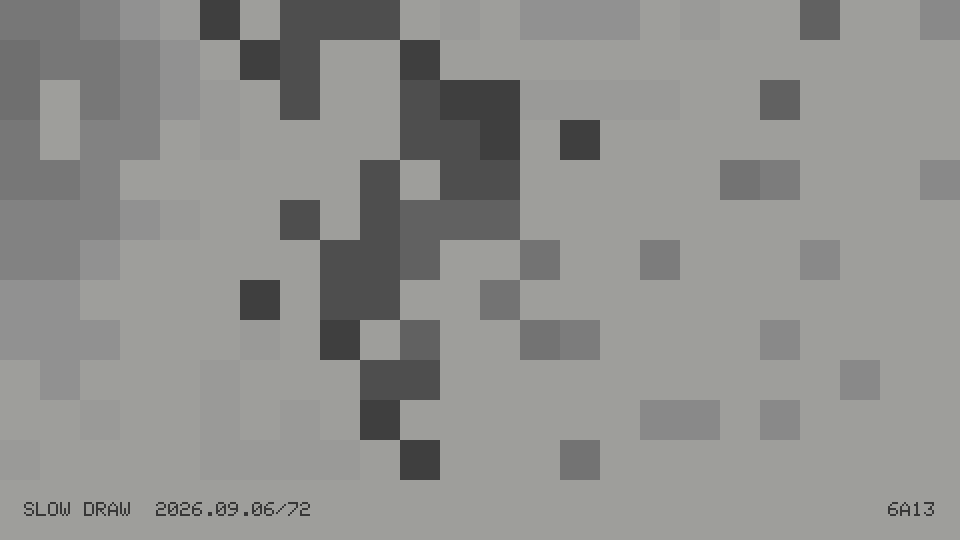
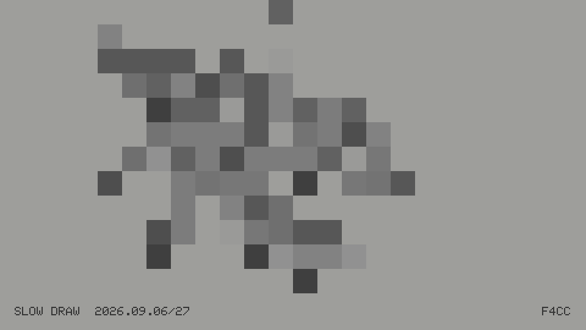

# Slow Draw

Slow Draw is an offline generative-art experience for the original M5Paper
1.1. On each
boot it reads the hardware RTC, derives a deterministic seed from the calendar
date and generator version, renders one monochrome composition, refreshes the
e-paper display, and sleeps until just after midnight.





The current curated generator uses four grammars. Cellular Aggregate grows
connected cells from a seeded random walk; grayscale follows angle and distance
through the resulting mass, while a few detached cells create visual echoes.
Pixel Field distributes the same uniform square pixels independently across the
full canvas, with broad mathematical fields controlling density, omissions, and
grayscale. Subdivision arranges patterned macro-cells made from smaller pixels,
using woven checks, diagonal bands, or corner knots. Dither Pressure converts
smooth abstract fields into hard black-and-white Bayer screens or Atkinson
error diffusion. None of the
grammars deliberately depict a character, object, or environment,
though forms may occasionally feel suggestive. Artwork is quantized to a
240-pixel-wide logical grid and displayed as crisp 4 × 4 blocks. The renderer
uses all 16 native grayscale levels of the M5Paper panel alongside deliberate
ordered dithering and high-contrast value clusters.
The surrounding background is always pure white; grayscale is confined to the
aggregate itself.
Artwork stops on the last complete grid row before the footer, leaving clean
white separation; no cell is clipped by the centered label area.
All connected and detached cells share one size and one global alignment grid;
cells are never individually inset, shifted, or reduced.

Pressing the center of the side rocker generates the next deterministic same-day
variant. The original slow draw is variant zero; alternates are identified by
`/1`, `/2`, and so on. Between presses the ESP32 uses light sleep, waking from
the rocker or automatically just after midnight.

Pressing the rocker left or right cycles the persistent recipe preference:
`ALL`, `CELLULAR`, `PIXEL FIELD`, `SUBDIVISION`, and `DITHER`. The selected name
briefly appears in the center of the footer and then disappears. A specific
recipe constrains center-button variants and future daily prints to that family;
`ALL` retains deterministic selection across every active family.

## Build and upload

Install PlatformIO, connect the M5Paper 1.1, then run:

```sh
pio run
pio run --target upload
pio device monitor
```

If the device RTC is unset, the firmware initializes it from the computer's
local build timestamp on first boot. No Wi-Fi or manual clock setup is needed.

The display is targeted at 960 × 540 in landscape orientation. Generator output
is deterministic for `(date, variant, generator version, recipe mode)`. The
recipe mode is folded into the full 32-bit seed, so the same date and variant
have distinct seeds in each locked recipe. `ALL` preserves the original seed
sequence. The seed's top two bits encode the actual recipe, making the complete
eight-digit hexadecimal seed sufficient to replay the artwork by itself. The
footer displays that complete seed rather than a shortened suffix. Changing
`kGeneratorVersion` intentionally starts a new sequence.

## Framebuffer capture

The retained 16-shade framebuffer can be captured over the USB cable:

```sh
./tools/capture.py
```

Captures are saved as `slow-draw-001.png`, `slow-draw-002.png`, and so on.
Capture resets the sleeping device so its USB serial connection answers
reliably. The current date and variant are restored from storage, so it rerenders
the same artwork before transferring the framebuffer. Pass `--no-reset` to try
capturing without a reset.
Use `--variant NUMBER` to recreate, select, and capture a particular same-day
variant. The selected variant persists across restarts for the current date.

To temporarily recreate and capture an artwork from its complete displayed
seed, without changing the RTC or saved current print:

```sh
./tools/capture.py --seed E92B7DE2
```

To recolor a capture with the muted, slightly warm 16-tone palette measured
from the photographed M5Paper display:

```sh
./tools/eink_preview.py slow-draw-001.png
```

The source is preserved. Repeated previews are saved as
`slow-draw-001-eink.png`, `slow-draw-001-eink-002.png`, and so on.
