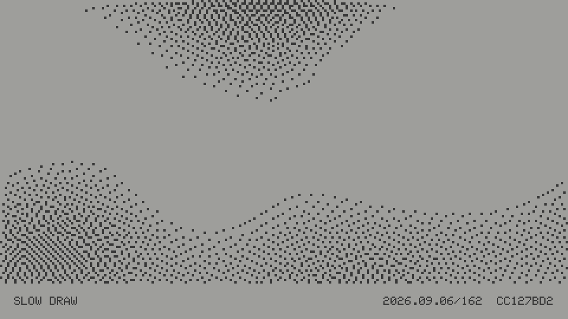
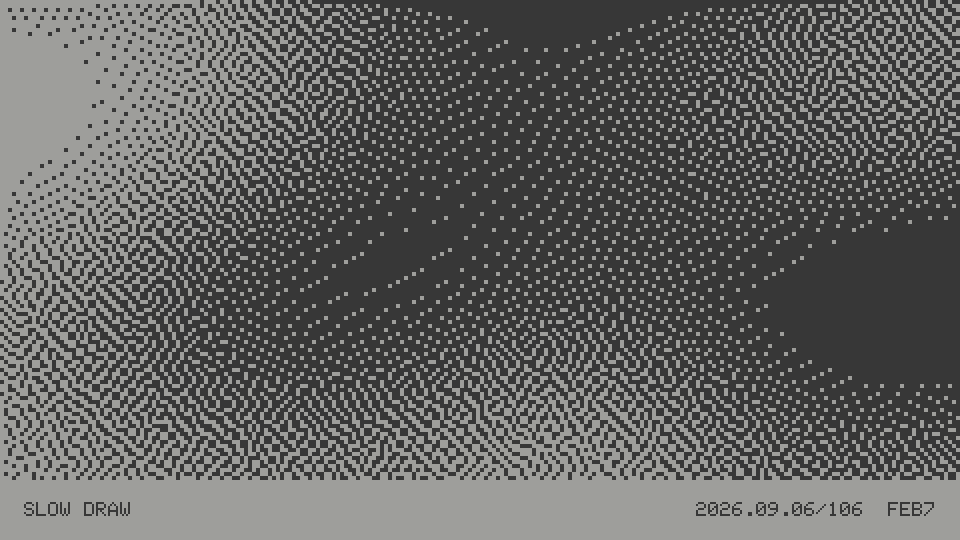
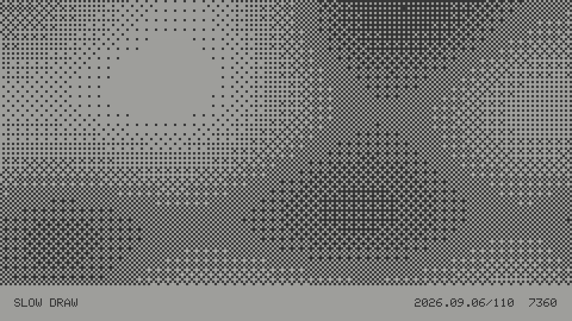
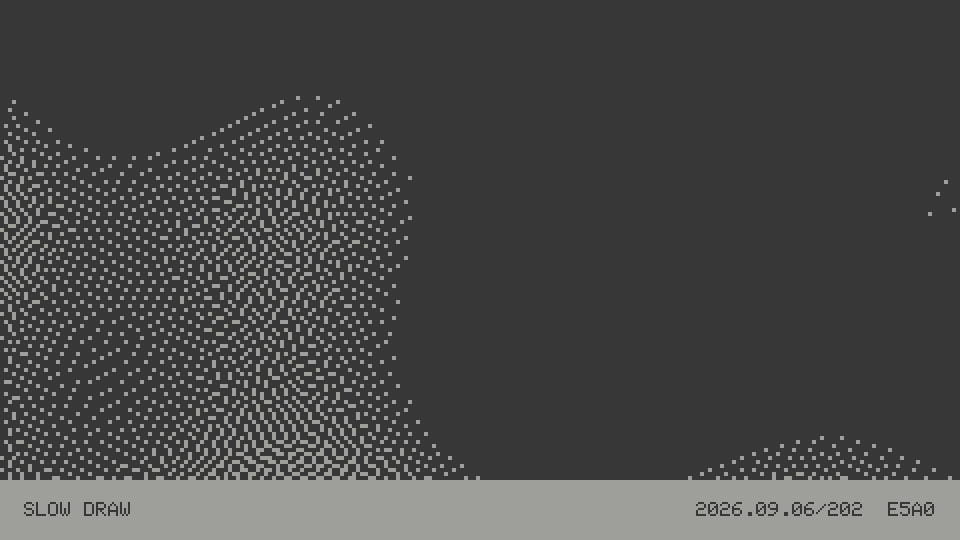
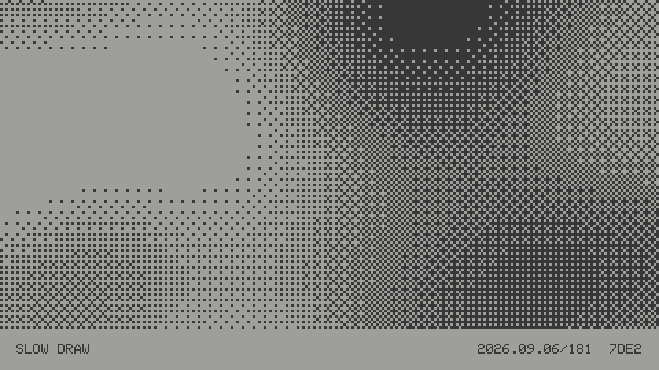
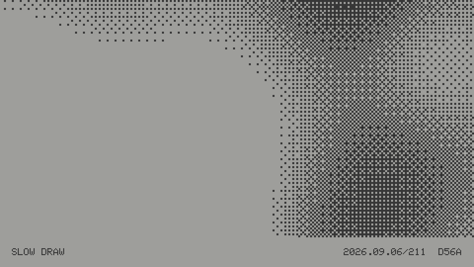
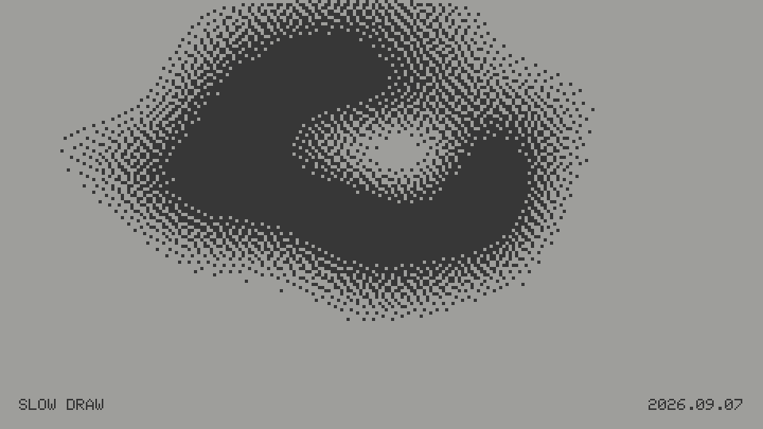

# Slow Draw

Slow Draw is an e-ink art project for the original M5Paper 1.1. It reads the hardware RTC, derives a seed, renders a composition using the panel's 16 grayscale levels, and sleeps until the next scheduled print or user interaction.





- Cellular Aggregate grows
connected cells from a seeded random walk; grayscale follows angle and distance through the resulting mass, while a few detached cells create visual echoes.
- Pixel Field distributes square pixels independently across the canvas, with broad mathematical fields controlling density, omissions, and grayscale.
- Subdivision arranges patterned macro-cells made from smaller pixels, using woven checks, diagonal bands, or corner knots.
- Dither Pressure converts smooth abstract fields into hard black-and-white Bayer screens or Atkinson error diffusion.
- Murmuration builds compressed, folding flock-like volumes from overlapping and subtractive fields, then renders them with Atkinson diffusion so dense cores dissolve into turbulent edges.

Press the center of the side rocker to generate the next deterministic variant for the current day or active hour. Between updates the ESP32 uses light sleep, waking from the rocker, touchscreen, USB serial, or the next scheduled interval.

Press the rocker left or right to cycle the current recipe preference: `ALL`, `CELLULAR`, `PIXEL FIELD`, `SUBDIVISION`, `DITHER`, and `MURMURATION`.

Tap the artwork to open `PRINT OPTIONS`
- The 10-character replay code for the current artwork
- Daily mode creates one scheduled print just after midnight.
- Hourly mode operates only during desk hours, producing prints at 7:00, 8:00, and each hour through 17:00. The 17:00 print remains unchanged overnight until the next morning's 7:00 print.

## Build and upload

Install PlatformIO, connect the M5Paper 1.1, then run:

```sh
pio run
pio run --target upload
pio device monitor
```

If the device RTC is unset, the firmware initializes it from the computer's
local build timestamp on first boot. No Wi-Fi or manual clock setup is needed.

## Framebuffer capture

The retained 16-shade framebuffer can be captured over the USB cable:

```sh
./tools/capture.py
```

Captures are saved as `slow-draw-001.png`, `slow-draw-002.png`, and so on.
Capture resets the sleeping device so its USB serial connection answers
reliably. The current date and variant are restored from storage, so it rerenders
the same artwork before transferring the framebuffer.

Use `--variant NUMBER` to recreate, select, and capture a particular variant in
the current day or hour. The selected variant persists for that print period.

To temporarily recreate and capture an artwork from the complete replay code
shown in `PRINT OPTIONS`, without changing the RTC or saved current print:

```sh
./tools/capture.py --seed 0FE92B7DE2
```

Replay identities from unsupported generator versions are rejected rather than
rendered incorrectly.

To recolor a capture with the muted, slightly warm 16-tone palette measured
from the photographed M5Paper display:

```sh
./tools/eink_preview.py slow-draw-001.png
```

The source is preserved. Repeated previews are saved as
`slow-draw-001-eink.png`, `slow-draw-001-eink-002.png`, and so on.
